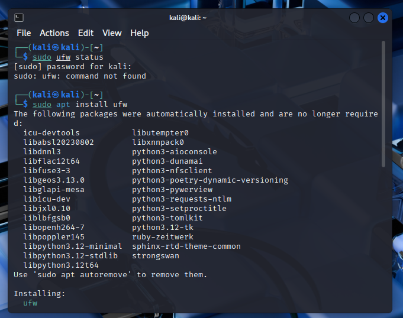
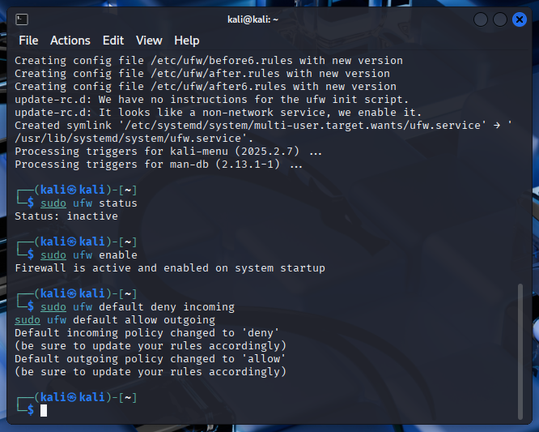
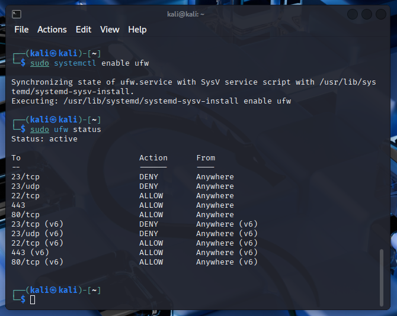
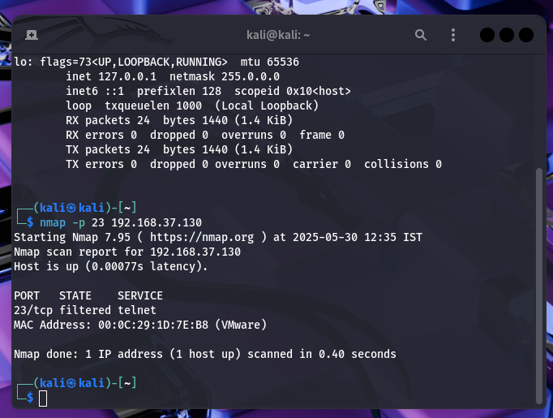
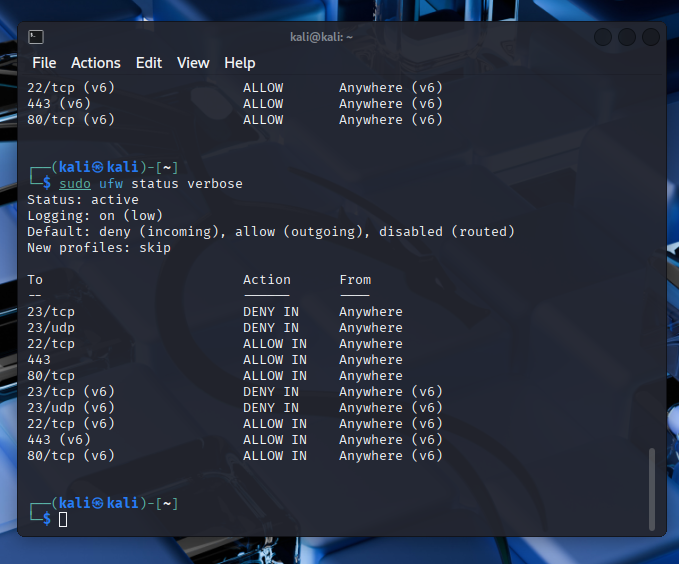

# UFW Firewall Configuration Project Report🛡️🔥🧱

This report provides a comprehensive analysis of the UFW (Uncomplicated Firewall) setup and configuration performed on a Kali Linux system, demonstrating practical network security implementation and testing.

## 📋 Project Overview

**Objective:** Configure and test basic firewall rules using UFW to control network traffic flow  
**System:** Kali Linux (192.168.37.130)  
**Testing Environment:** Multi-host network setup with remote testing capabilities  
**Date:** May 30, 2025  
**Duration:** Complete implementation and testing cycle

## 🛠️ Implementation Analysis

### **Initial System State**
The project began with UFW not installed on the target Kali Linux system. This required package installation before any firewall configuration could proceed.

### Step-by-step Process
## Installing UFW in linux using the command:
`sudo apt update && sudo apt install ufw`

##  Enabling UFW using the command:
`sudo ufw enable`

## Make UFW start on boot using following command:
`sudo systemctl enable ufw`

## Enable logging to monitor firewall activity with the command:
`sudo ufw logging on`
## Set Default policy in UFW by command:
`sudo ufw default deny incoming` `sudo ufw default allow outgoing`
## Block Inbound Traffic on Port 23 (Telnet) using command:
`sudo ufw deny 23/tcp` `sudo ufw deny 23/udp`
##  Allow SSH Access (Port 22) by command:
`sudo ufw allow ssh`
## Test firewall rules by following command: 
`telnet localhost 23`  Or `sudo netstat -tlnp`   Or
Use other system to test with following command: 
`nmap -p 23 your_ip`

## Success end Result

---

## 📊 Security Impact Assessment

### **Threat Mitigation Achieved**

**Telnet Security Enhancement:**
- **Risk Eliminated:** Unencrypted credential transmission
- **Attack Vector Blocked:** Remote unauthorized access via Telnet
- **Compliance Improvement:** Aligned with security best practices

**Network Segmentation:**
- **Default Deny Policy:** Reduces attack surface significantly
- **Service Isolation:** Only essential services exposed
- **Dual-Stack Protection:** IPv4 and IPv6 coverage

### **Operational Considerations**

**Positive Impacts:**
- Enhanced security posture without service disruption
- Maintained administrative access via SSH
- Web services remain functional
- Comprehensive logging for security monitoring

**Potential Limitations:**
- Stateless filtering may not detect sophisticated attacks
- No application-layer inspection
- Limited intrusion detection capabilities

## 🎯 Best Practices Demonstrated

### **Configuration Management**
1. **Systematic Approach:** Logical rule ordering and testing
2. **Documentation:** Comprehensive command logging and verification
3. **Persistence:** Service enablement for boot-time activation
4. **Monitoring:** Logging configuration for security awareness

### **Security Principles Applied**
- **Principle of Least Privilege:** Only necessary ports opened
- **Defense in Depth:** Multiple rule types for comprehensive protection
- **Fail-Safe Defaults:** Default deny policy implementation
- **Auditability:** Logging enabled for security monitoring

## 🔍 Technical Deep Dive

### **UFW Architecture Understanding**

UFW operates as a **frontend to iptables**, providing simplified rule management while maintaining the robust filtering capabilities of the underlying netfilter framework. The implementation demonstrates:

- **Rule Translation:** UFW commands automatically generate appropriate iptables rules
- **Chain Management:** Proper integration with INPUT, OUTPUT, and FORWARD chains
- **State Tracking:** Connection state awareness for enhanced security
- **Performance Optimization:** Efficient rule ordering for minimal latency impact

### **Network Traffic Flow Analysis**

The firewall implementation creates the following traffic flow control:

1. **Incoming Traffic Evaluation:**
   - Default DENY policy applied first
   - Explicit ALLOW rules checked sequentially
   - Blocked traffic logged (when logging enabled)

2. **Outgoing Traffic Management:**
   - Default ALLOW policy permits most outbound connections
   - No restrictions on client-initiated communications
   - Maintains system functionality for updates and external services

## 📋 Conclusion

This UFW firewall implementation project successfully demonstrated comprehensive network security configuration on Kali Linux. The systematic approach to rule implementation, thorough testing methodology, and proper documentation practices showcase effective cybersecurity implementation.

**Key Achievements:**
- ✅ Successful UFW installation and configuration
- ✅ Implementation of security-focused default policies
- ✅ Effective blocking of insecure Telnet protocol
- ✅ Preservation of essential administrative and web services
- ✅ Comprehensive testing validation from remote systems
- ✅ Dual-stack IPv4/IPv6 protection implementation

The project establishes a solid foundation for network security while maintaining operational functionality, demonstrating the balance required in practical cybersecurity implementations.

---

*Project completed on Kali Linux with comprehensive testing and validation across multiple network hosts.*

## 🚀 Recommendations for Enhancement

### **Immediate Improvements**
1. **Rate Limiting:** Implement connection rate limiting for SSH
2. **Geo-blocking:** Consider IP-based geographic restrictions
3. **Port Knocking:** Advanced SSH access control mechanisms
4. **Intrusion Detection:** Integration with fail2ban or similar tools

### **Advanced Security Measures**
1. **Application Layer Filtering:** Consider proxy-based solutions
2. **Network Segmentation:** VLAN implementation for enhanced isolation
3. **Monitoring Integration:** SIEM system connectivity for centralized logging
4. **Automated Response:** Dynamic rule updates based on threat intelligence

