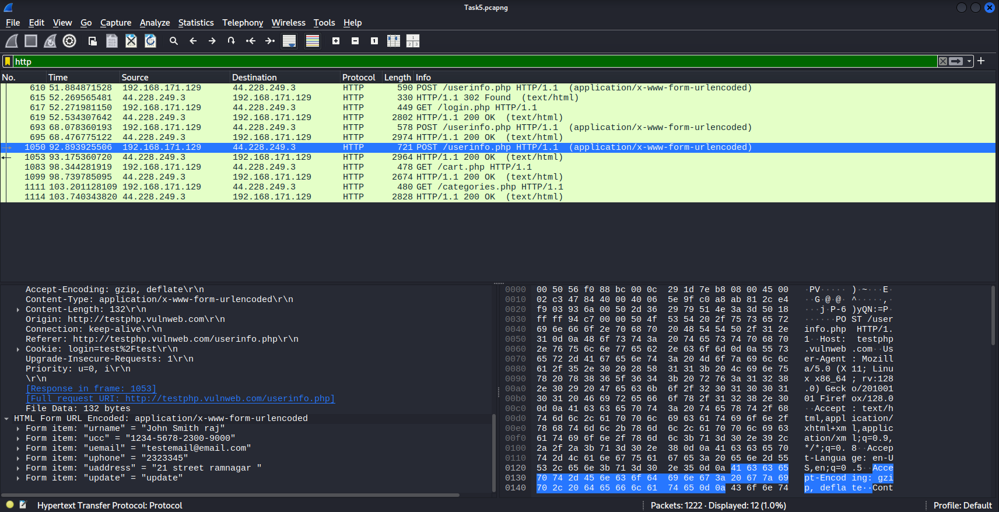
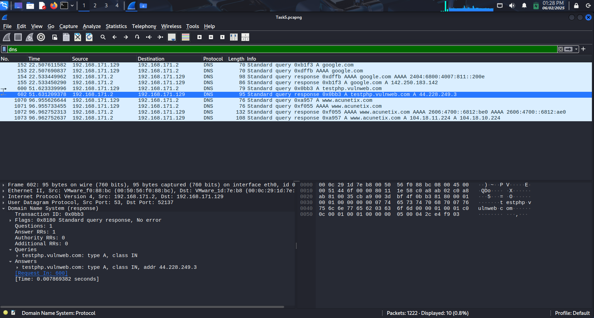
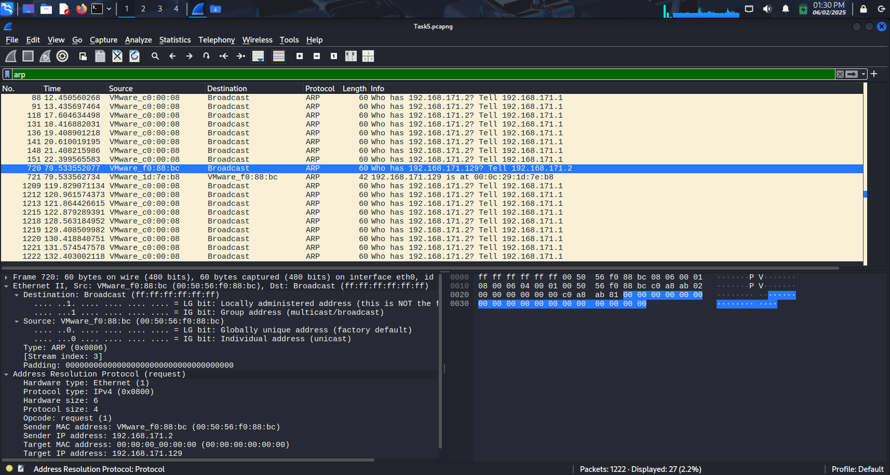
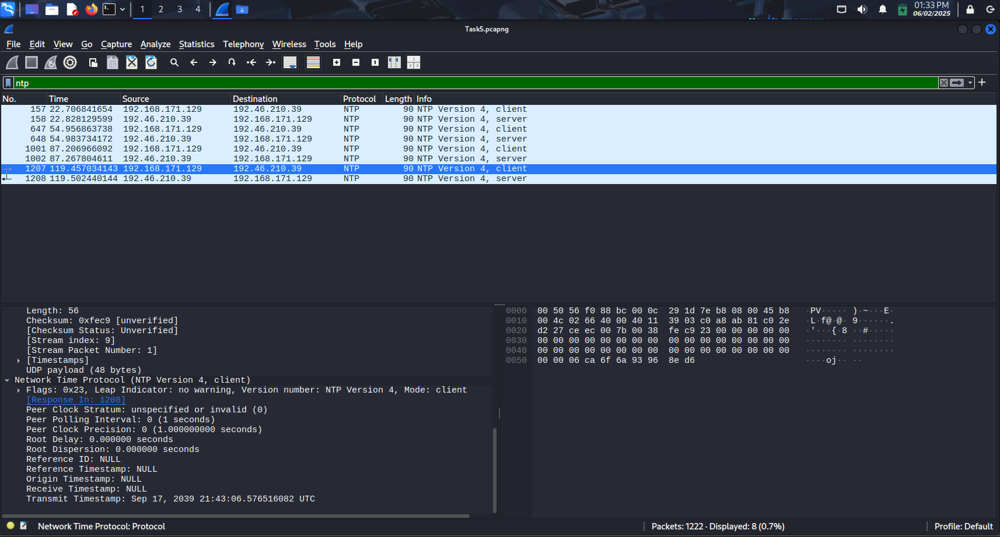
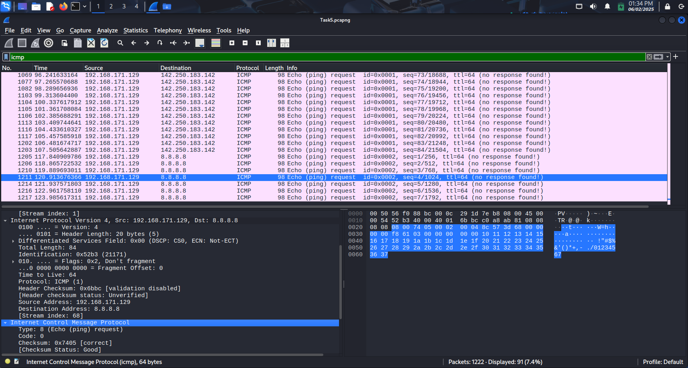
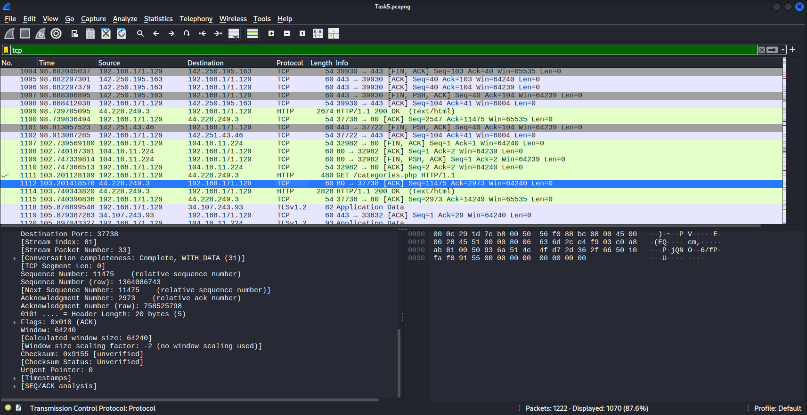

# Network Traffic Analysis with Wireshark  

## 📋 Project Overview

This project demonstrates network packet capture and analysis using Wireshark to identify protocols and analyse traffic patterns in a controlled environment.

**Objective:** Capture live network packets and identify basic protocols and traffic types using Wireshark.

## 🛠️ Tools Used

- **Wireshark** (Free network protocol analyzer)
- **VMware Virtual Environment**
- **Firefox Browser** (Traffic generation)
- **Target:** testphp.vulnweb.com (Vulnerable web application for testing)

## 📊 Executive Summary

Successfully captured and analyzed network packets, identified multiple protocols including `HTTP`, `DNS`, `TCP`, `ICMP`, `NTP` and `ARP`. The analysis revealed critical security vulnerabilities in unencrypted web traffic and demonstrated effective network monitoring techniques.

## 🔍 Protocols Identified

### 1. HTTP (Hypertext Transfer Protocol) : Application layer protocol for transferring web pages and data between browsers and web servers.

- **Packets Analyzed:** 12 HTTP requests/responses
- **Target Server:** testphp.vulnweb.com (44.228.249.3)
- **Request Types:** POST and GET requests
- **Critical Finding:** Unencrypted sensitive data transmission

### 2. DNS (Domain Name System) : System that translates human-readable domain names (like google.com) into IP addresses that computers use.

- **Packets Analyzed:** 10 DNS queries/responses
- **Primary Queries:** google.com, testphp.vulnweb.com, acunetix.com
- **DNS Server:** 192.168.171.2
- **Average Response Time:** 7.8ms

### 3. ARP (Address Resolution Protocol) : Protocol that maps IP addresses to physical MAC addresses on local network segments.

- **Packets Analyzed:** 19 ARP requests/responses
- **Function:** MAC address resolution and network discovery
- **Environment:** VMware virtual network

### 4. NTP (Network Time Protocol) : Protocol that synchronizes computer clocks across networks to maintain accurate time.

- **Packets Analyzed:** NTP requests/responses
- **Purpose:** System time synchronization
- **Port:** UDP 123
- **Time Servers:**
- **Sync Frequency:** 

### 5. ICMP (Internet Control Message Protocol) :  Network diagnostic protocol used for error reporting and network troubleshooting (like ping commands).

- **Packets Analyzed:** ICMP messages
- **Types Observed:** 
  - Echo Request/Reply (ping)
- **Purpose:** Network diagnostics and error reporting

### 6. TCP (Transmission Control Protocol) :  Reliable transport protocol that ensures data is delivered completely and in the correct order between devices.

- **Packets Analyzed:** [Majority of your 1,222 packets]
- **Purpose:** Reliable, connection-oriented transport protocol
- **Key Features:**
  - Three-way handshake connection establishment
  - Sequence numbers for ordered delivery
  - Acknowledgment-based reliability
  - Flow and congestion control
- **Carries:** HTTP, DNS (sometimes), and other application protocols
- **Security Note:** Underlying transport for your HTTP traffic

## 🚨 Security Findings

### Critical Vulnerabilities Discovered

**1. Exposed Personal Data (HIGH RISK)**
Captured Form Data:
Username: "John Smith raj"
Credit Card: "1234-5678-2300-9000"
Email: "testemail@email.com"
Phone: "2323345"
Address: "21 street ramnagar"

**2. Unencrypted HTTP Traffic**
- All communications transmitted in plaintext
- Session cookies exposed
- Vulnerable to man-in-the-middle attacks

## 🔧 Methodology

### Step-by-Step Process

1. **Environment Setup**
   - Installed Wireshark on VMware virtual machine `sudo apt install wireshark`
   - Configured network interface for packet capture

2. **Traffic Generation**
   - Browsed testphp.vulnweb.com
   - Performed DNS lookups (google.com, acunetix.com)
   - Submitted forms with test data

3. **Packet Capture**
   - Duration: ~2 minutes
   - Total packets: 1,222
   - Interface: VMware virtual network adapter

4. **Analysis Techniques**
   - Protocol filtering (http, dns, arp)
   - Statistical analysis using Wireshark
   - Packet-level inspection and data extraction

## 📋 Key HTTP Requests Analyzed

### POST Request to /userinfo.php
POST /userinfo.php HTTP/1.1
Host: testphp.vulnweb.com
User-Agent: Mozilla/5.0 (X11; Linux x86_64; rv:128.0)
Content-Type: application/x-www-form-urlencoded
Cookie: login=test%2Ftest
Content-Length: 132

### GET Requests
- `/login.php` - Authentication page
- `/cart.php` - Shopping cart functionality
- `/categories.php` - Product categories

### 📊 Protocol Relationship Map

<pre>
📱 <strong>Application Layer</strong>
   ├── 🌐 HTTP (Web traffic)
   ├── 🔍 DNS (Name resolution)  
   └── ⏰ NTP (Time synchronization)

📦 <strong>Transport Layer</strong>
   └── 🚚 TCP (Reliable transport)

🌐 <strong>Network Layer</strong>
   └── 🔧 ICMP (Network diagnostics)

🔗 <strong>Data Link Layer</strong>
   └── 📍 ARP (MAC address resolution)
</pre>

# 🎯 Skills Demonstrated

### Primary Skills

🔍 Network Protocol Analysis - Successfully identified and analyzed multiple protocols

🛡️ Security Assessment - Detected critical vulnerabilities in network traffic

📊 Traffic Pattern Recognition - Understood typical web application communication flows

🕵️ Forensic Analysis - Extracted sensitive data from packet captures

### Technical Competencies

⚡ Wireshark Proficiency - packet capture and analysis

🔧 Protocol Filtering - statistical analysis techniques

🚨 Vulnerability Assessment - Network security threat identification

📝 Technical Documentation - Comprehensive reporting of findings
  
## 🚀 Future Enhancements

### Recommended Next Steps
1. **Encrypted Traffic Analysis:** Practice with HTTPS/TLS traffic
2. **Advanced Protocols:** Explore SMTP, FTP, SSH analysis
3. **Automated Analysis:** Develop scripts for pattern detection
4. **Baseline Establishment:** Create normal traffic baselines
5. **Real-time Monitoring:** Implement continuous traffic analysis

### Advanced Analysis Techniques
- **Deep Packet Inspection (DPI)** for application-layer analysis
- **Network Behavior Analysis (NBA)** for anomaly detection
- **Threat Intelligence Integration** for malicious traffic identification
- **Machine Learning** for automated pattern recognition in production environments.

---

*This project demonstrates the critical importance of network security monitoring and the power of tools like Wireshark for traffic analysis and vulnerability detection.*
