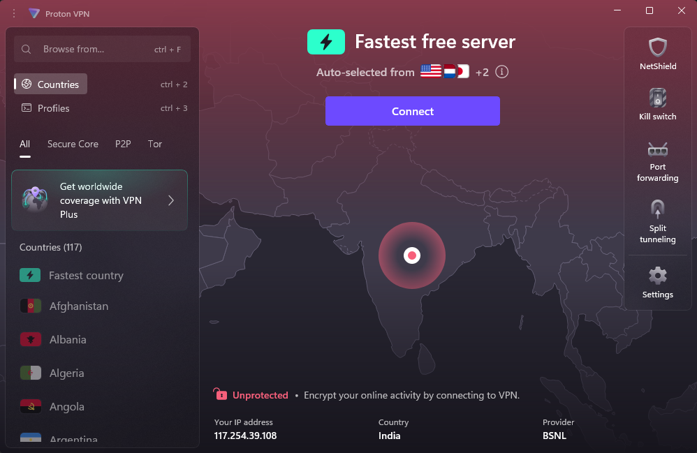
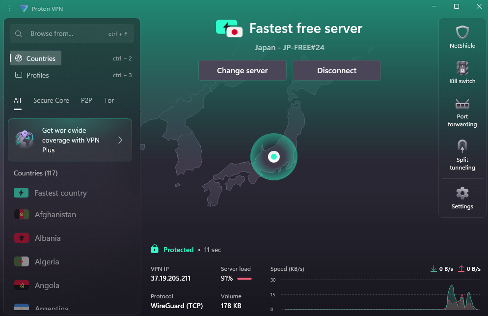
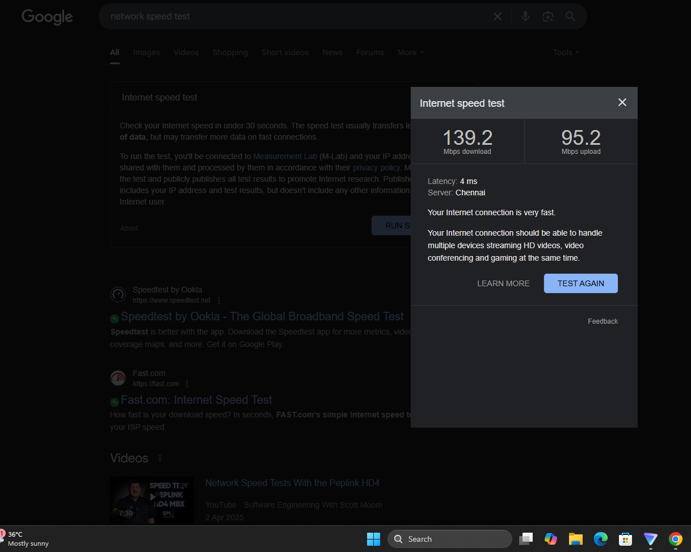
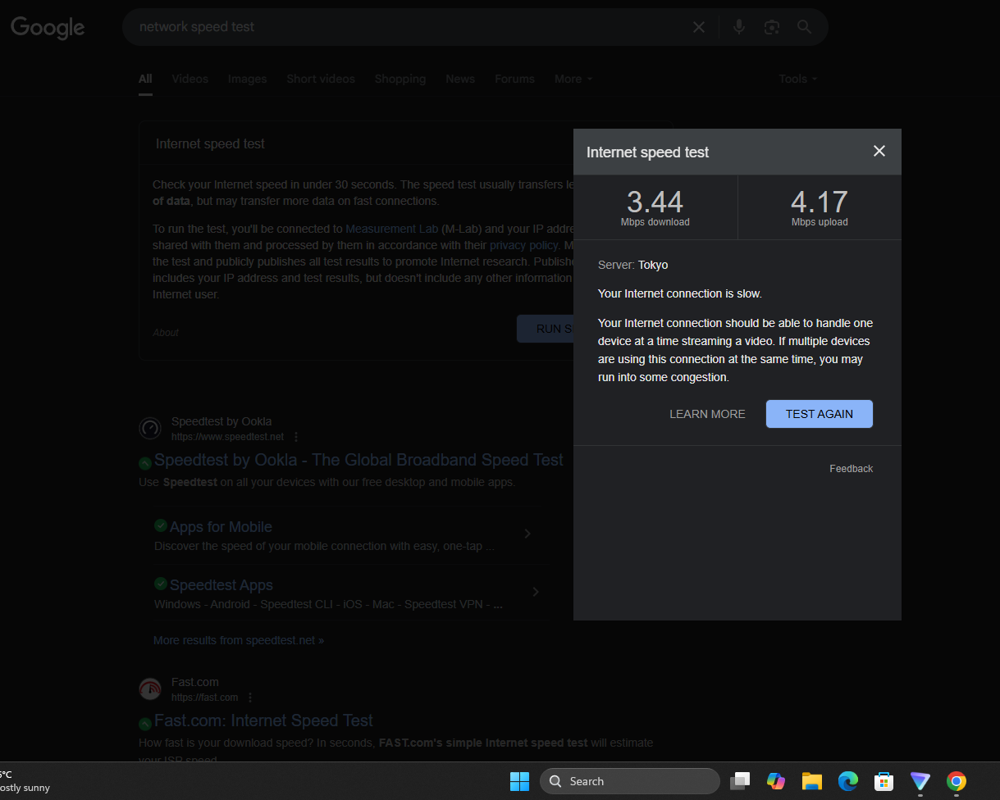
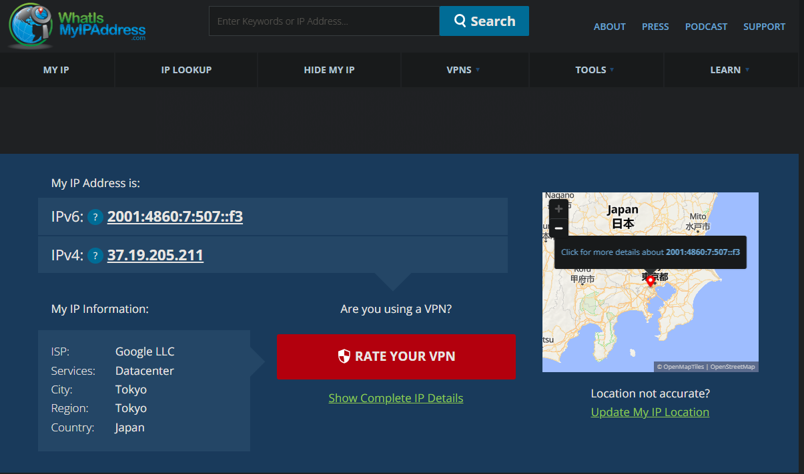

# 🛡️ VPN Privacy & Security Report

---

## 🎯 Objective

Understand the role of VPNs in protecting privacy and securing communication by setting up a free VPN client, verifying its operation, and analyzing its impact on network speed and IP address.

---

## 🔍 Choosing and Setting Up a Free VPN

**Selected VPN:** 🟢 **ProtonVPN**

> ProtonVPN is widely regarded as one of the best free VPNs in 2025, offering unlimited data, no ads, and strong privacy features.

### 🚦 Steps for Setup

#### 1️⃣ Sign Up  
- 🌐 Go to the [ProtonVPN website](https://protonvpn.com).
- 🟩 Click **“Get Proton VPN Free.”**
- 📝 Create an account with a username, password, and email address.
- ✅ Verify your account via email or SMS by entering the received code.

#### 2️⃣ Download and Install  
- 💻 After account creation, download the ProtonVPN client for your operating system (Windows, macOS, Linux, iOS, Android, Chromebook).
- 📦 Run the installer and follow the prompts to complete installation.

#### 3️⃣ Log In and Connect  
- 🔑 Open the ProtonVPN app and log in with your credentials.
- ⚡ Click **“Quick Connect”** to automatically connect to the fastest available free server (locations include the US, Netherlands, Japan, Romania, Poland).
- 🌏 Alternatively, manually select a server from the available free locations.

---

## 🛠️ VPN Setup Steps

1. **Choose a reputable free VPN:**  
   Selected ProtonVPN for its strong privacy reputation and unlimited free tier.

2. **Sign up:**  
   Registered for a ProtonVPN account via their official website.

3. **Download and install:**  
   Installed the ProtonVPN client for Windows.

4. **Connect to a VPN server:**  
   Connected to the fastest free server (Japan - JP-FREE#24).

5. **Verify IP address change:**  
   Used whatismyipaddress.com and ProtonVPN client to confirm new IP.

6. **Browse and test encryption:**  
   Browsed websites and ran speed tests to confirm encrypted traffic.

7. **Disconnect and compare:**  
   Disconnected VPN to compare changes in speed and IP.

8. **Research VPN features:**  
   Investigated ProtonVPN’s encryption and privacy measures.

---

## 📸 Before vs After: Screenshots & Results

### 🔗 Connection Status

| State         | Screenshot      | Description                                     |
|---------------|----------------|-------------------------------------------------|
| **Before VPN**  |  | Not connected, real IP/location visible.        |
| **After VPN**   |   | Connected to Japan server, new VPN IP assigned. |

---

### 🚀 Network Speed Test

| State         | Screenshot      | Download (Mbps) | Upload (Mbps) | Server Location |
|---------------|----------------|-----------------|--------------|----------------|
| **Before VPN**  |  | 139.2           | 95.2           | Chennai        |
| **After VPN**   |   | 3.44            | 4.17           | Tokyo          |

- **Observation:**  
  VPN connection to a distant server (Japan) significantly reduced download/upload speeds due to encryption and routing overhead.

---

### 🌍 IP Address Change

- **Before VPN:**  
  - IP: `117.254.39.108`  
  - Location: India

- **After VPN:**  
  - IP: `37.19.205.211`  
  - Location: Japan

- **Result:**  
  IP address and visible location changed, confirming VPN is masking real identity and encrypting traffic.
  

---

## 🔒 VPN Encryption & Privacy Features

- **Encryption:**  
  Uses AES-256 encryption via WireGuard (TCP), providing strong protection for data in transit.
- **No-logs policy:**  
  ProtonVPN does not track or store user activity.
- **Kill switch:**  
  Prevents data leaks if VPN disconnects.
- **DNS leak protection:**  
  Ensures DNS requests are also encrypted.

---

## ✅ Benefits & ⚠️ Limitations of VPN

### ✅ Benefits

- **Encrypts all internet traffic**: Protects sensitive data from hackers and ISPs.
- **Masks IP address and location**: Enhances online anonymity.
- **Bypasses geo-restrictions**: Access region-locked content.
- **Public Wi-Fi protection**: Secures data on unsecured networks.

### ⚠️ Limitations

- **Reduced speed**: Notable drop in speed, especially when connected to distant servers.
- **Free tier restrictions**: Limited server choices and features.
- **Not full anonymity**: Cannot prevent all tracking (e.g., browser fingerprinting).
- **Potential compatibility issues**: Some apps or services may block VPN traffic.

---

## 🏁 Conclusion

Setting up and using ProtonVPN successfully demonstrated how VPNs encrypt internet traffic, mask real IP addresses, and protect privacy online. However, users should expect some reduction in speed, especially on free plans and when connecting to distant servers. VPNs are a crucial tool for privacy-conscious users, but they are not a complete solution for all online threats.

---

