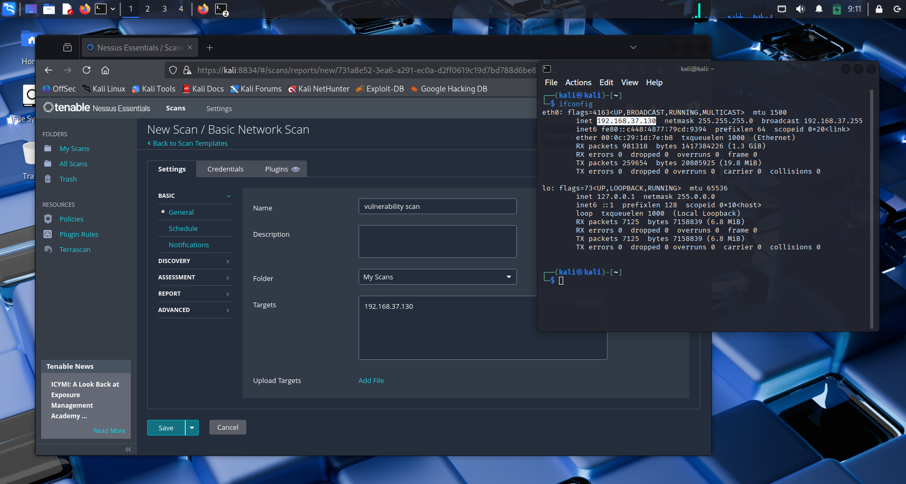
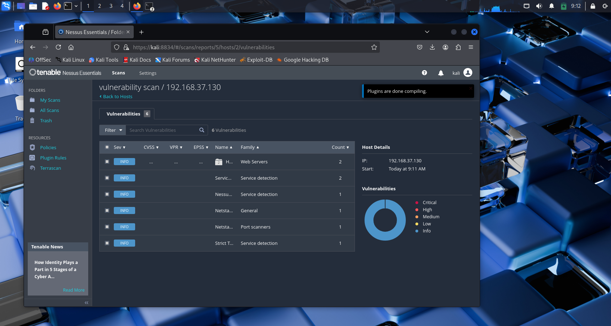
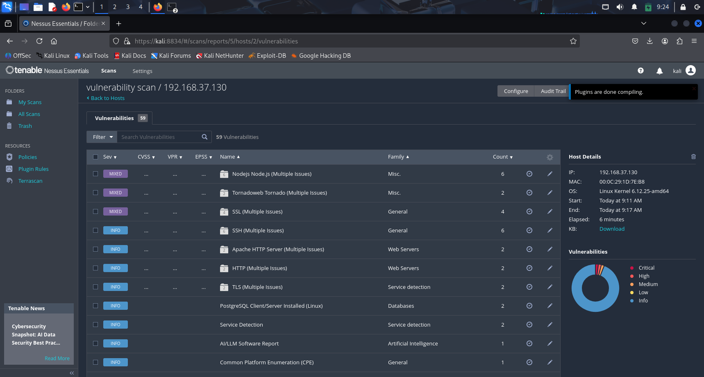

# Cybersecurity Vulnerability Assessment Project

## 📋 Project Overview

This repository contains the implementation and documentation of a comprehensive vulnerability assessment project using Tenable Nessus Essentials. The project demonstrates practical cybersecurity skills including vulnerability scanning, analysis, and remediation planning.

## 🎯 Objectives

- Perform a comprehensive vulnerability scan on a local system
- Identify and analyze security vulnerabilities using industry-standard tools
- Document findings and provide actionable remediation strategies
- Demonstrate practical cybersecurity assessment skills

## 🛠️ Tools Used

- **Tenable Nessus Essentials**: Primary vulnerability scanner
- **Kali Linux**: Target system for vulnerability assessment

## 🔍 Methodology

### Phase 1: Environment Setup
1. Installed Nessus Essentials on assessment system
2. Configured scan target (192.168.37.130 - Kali Linux)
3. Verified network connectivity and service accessibility

### Phase 2: Vulnerability Scanning
1. Executed comprehensive vulnerability scan using Nessus
2. Targeted localhost/local machine IP address
3. Performed full system assessment (30-60 minute duration)
4. Generated detailed vulnerability report

### Phase 3: Analysis and Documentation
1. Analyzed scan results for critical vulnerabilities
2. Categorized findings by severity level
3. Researched remediation strategies
4. Documented comprehensive assessment report

## 📸Screenshots
# Configurring ip address for vulnerability scanning

# Running vulnerability scan in Nessus Essential tool

# Result dashboard in Neesus Essential

## 📊 Key Findings

### Critical Vulnerabilities Identified

#### SSL/TLS Certificate Issues
- **Severity**: Medium to High
- **Location**: Port 8834 (Nessus Web Interface)
- **Issue**: Broken CA Chain detected
- **Impact**: Potential for man-in-the-middle attacks

#### Service Exposure Assessment
- **Active Services**: Nessus (8834), PostgreSQL (5432), SSH
- **Network Bindings**: Multiple services with varying exposure levels
- **Security Concern**: Service configuration review required

### Software Inventory Analysis
- **OpenSSL 3.5.0**: Multiple instances detected
- **Apache 2.4.63**: Web server with various modules
- **PHP 8.4.6**: Server-side scripting environment
- **Java OpenJDK 21.0.7**: Runtime environment
- **Python 3.13**: Multiple installations identified

## 🛡️ Remediation Recommendations

### Immediate Actions Required
1. **SSL Certificate Chain Repair**

2. **Service Hardening**
- Review and minimize running services
- Implement proper access controls
- Configure firewall rules appropriately

3. **Security Updates**
- Verify all software is current with security patches
- Implement automated update mechanisms where appropriate

### Long-term Security Improvements
- Implement comprehensive monitoring and logging
- Regular vulnerability scanning schedule
- Security awareness and training programs
- Incident response procedure development

## 📈 Scan Statistics

- **Target System**: Kali Linux (192.168.37.130)
- **Scanner Version**: Tenable Nessus 10.8.4
- **Scan Duration**: 30-60 minutes
- **Total Checks**: Comprehensive vulnerability assessment
- **Coverage**: Network services, software inventory, configuration analysis

## 🔧 Technical Implementation

### System Configuration
- **Operating System**: Linux Kernel 6.12.25-amd64
- **Distribution**: Kali 6.12.25-1kali1
- **Network Configuration**: DHCP client with multiple service bindings
- **Security Tools**: Comprehensive penetration testing toolkit

### Vulnerability Categories Assessed
- Network service vulnerabilities
- SSL/TLS configuration issues
- Software version vulnerabilities
- System configuration weaknesses
- Access control implementations

## 📚 Learning Outcomes

Through this project, the following cybersecurity competencies were demonstrated:

1. **Vulnerability Assessment**: Practical experience with industry-standard scanning tools
2. **Risk Analysis**: Ability to categorize and prioritize security findings
3. **Remediation Planning**: Development of actionable security improvement strategies
4. **Documentation**: Professional security assessment reporting
5. **Tool Proficiency**: Hands-on experience with Nessus Essentials

## 🚀 Future Enhancements

- Integration with automated remediation tools
- Continuous monitoring implementation
- Advanced threat modeling exercises
- Penetration testing methodology expansion
- Security metrics and KPI development

