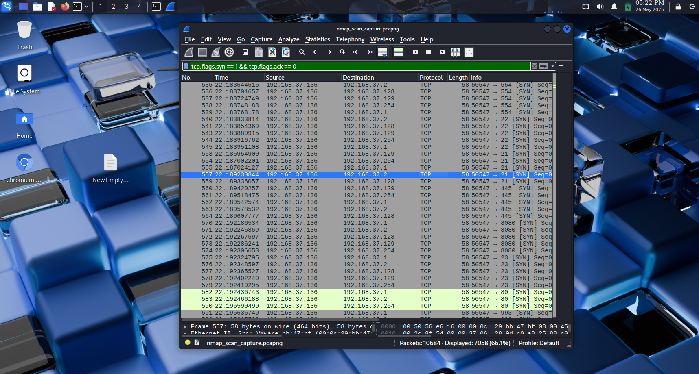

# 🔍 Local Network Port Scan – Elevate Lab Internship (Task 1)

## 🎯 Objective
To discover open ports on devices within the local network using **Nmap**, and optionally analyze packet captures using **Wireshark**, in order to understand network exposure and identify potential security risks.

---

## 🛠️ Tools Used

- **Nmap 7.95** (Installed on Windows)
- **Wireshark** – For capturing and analyzing network traffic
- **Kali_linux- Terminal**

---

## 📡 IP Range Scanned

- **Local IP Address**: `192.168.37.136`
- **Subnet Range**: `192.168.37.0/24`

---

### 🔧 Command Used:

ifconfig 192.168.37.136

nmap -sS 192.168.37.0/24 -oN scan_results.txt

---

### 🔐 Key Findings
6 devices responded within the scanned subnet.

Device 192.168.37.128 had several open ports, including:

Port 22 – SSH

Port 80 – HTTP

Port 139/445 – SMB

Port 3306 – MySQL

Port 3389 – RDP

Other hosts had mostly filtered or closed ports with no significant exposure.

---

### 📸 Screenshots
 
 
 

 ---

Wireshark SYN Packet Filter
Filter used:

tcp.flags.syn == 1 && tcp.flags.ack == 0

---

### ✅ Conclusion
This task provided hands-on experience in scanning a local network and analyzing the underlying traffic. It helped:

Identify potentially vulnerable services.

Understand how SYN scans operate at the packet level.

Reinforce the importance of reducing exposed ports to enhance network security.

### ⚠️ Note: All scans were performed in a safe, authorized lab environment for educational purposes only.

